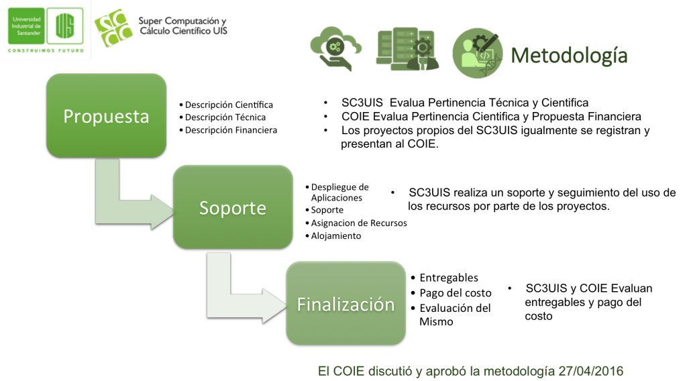
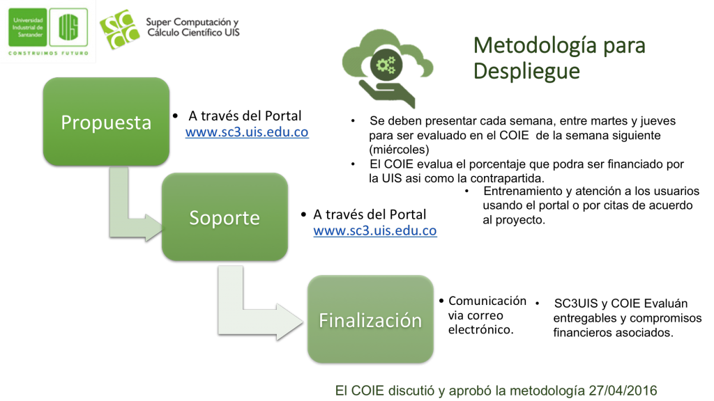
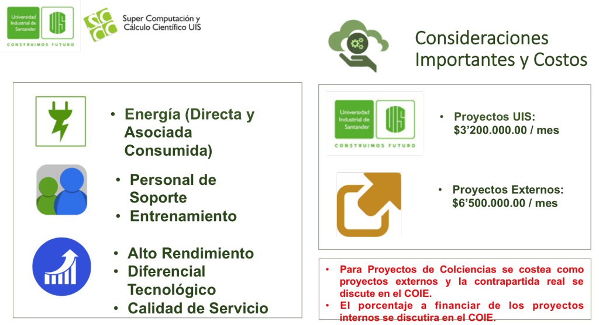

Supercomputación y Cálculo Científico UIS apoya el desarrollo de investigación, desarrollo, innovación y emprendimiento, con diferentes servicios de apoyo, que van desde el soporte para el despliegue y uso de aplicaciones, el desarrollo de aplicaciones científicas, la administración y alojamiento  de plataformas para cómputo cientifico y la mediación estratégica y consultoría de proyectos que involucren computación de alto rendimiento y tecnologías avanzadas de la información.

Estos servicios generan un costo asociado, que tras una metodología aprobada por el Comité Operativo de Investigación y Extensión de la Universidad Industrial de Santander (COIE) el 27 de abril de 2016, plantea  (5) cuatro servicios específicos:

* Despliegue de Aplicaciones para Ejecución
* Desarrollo de Software Cientifico
* Administración de Plataformas para Cómputo Cientifico
* Entrenamiento como Servicio HPC
* Consultoría y Mediación Estratégica

## **Metodología General**

La metodología busca ante todo organizar y establecer costos de soporte para cada uno de los proyectos. Es importante recalcar que todos los servicios y actividades del SC3UIS están enmarcados dentro de los ejes misionales de la UIS explícitamente y el soporte esta dado para Investigación y Desarrollo principalmente.

1. Existen únicamente (2) dos tipos de proyectos: 
    * **Proyectos UIS** realizados por cualquier grupo de investigación, entidad, centro, laboratorio o miembro de la comunidad UIS.
    * **Proyectos Externos** realizados por cualquier solicitante externo a la comunidad Universitaria UIS.
    
2. La pertinencia técnica y científica es tratada directamente por SC3UIS y el COIE evalúa la propuesta financiera de acuerdo a la evaluación y recomendaciones técnicas/científicas dadas por SC3UIS.
    
3. Todos los proyectos deben registrarse tanto en SC3UIS como en la vicerrectoria de investigación y extensión, ya sea como proyectos de investigación internos o proyectos de extensión, de acuerdo a la normativa general de la Universidad Industrial de Santander.

4. Una vez finalizados los proyectos, SC3UIS y el COIE evalúan los entregables y los cumplimientos de los compromisos financieros.

## **Condiciones Especiales**

Igualmente se estipularon condiciones especiales para los proyectos de acuerdo a lo siguiente:

1. Siguiendo la metodología, el COIE tiene en cuenta cuanto puede financiar o dar en contrapartida la Universidad Industrial de Santander para suplir los costos del proyecto.

2. Los proyectos que requieren despliegue para ejecución de aplicaciones, deben presentarse cada semana entre martes y jueves para ser evaluado ante el COIE en la reunión de la semana siguiente (miércoles).
    
3. Para proyectos que involucren despliegue, el mínimo tiempo de duración de proyecto es de (3) tres meses y para alojamiento y administración de plataformas (1) un año.

4. Los proyectos externos no aplican para administración de plataformas, pero los proyectos UIS, involucran un tiempo de (1) un año.

5. Los proyectos realizados internamente que no tengan ningún tipo de financiación, principalmente aquellos asociados a proyectos de grado en pregrado, maestría y doctorado, son financiados en un 100% en sus costos por el COIE, previo estudio de la propuesta en el COIE.

Teniendo en cuenta estas consideraciones generales, puede esquematizarse de la siguiente manera:

**La comunicación inicial debe realizarse con el director del SC3UIS o usando el portal actual.**

## Despliegue de Aplicaciones para Ejecución

Para este tipo de servicio se plantea la siguiente metodología, a través de este portal y siguiendo el enlace hacia la zona de usuarios.

Los costos asociados al proyecto son estipulados en una tarifa plana que tiene una cuenta máxima utilización posible, como ninguna, como se muestra a continuación.

* Adecuación (Tunning) y despliegue de aplicaciones para Ejecución (De acuerdo a licencias de software disponibles)

* Atención, monitoreo y soporte en el despliegue y la ejecución de aplicaciones sobre las plataformas.

* Posible entrenamiento sobre ciertas aplicaciones.

* 720 horas de cómputo por trabajo lanzado (máximo).

* Aceleración por Nvidia Tesla GPU, 104 GB de RAM por nodo. Máximo desempeño por nodo:
    * 0.99 TFlops (SP)
    * 0.65 TFlops (DP)

* **NO INVOLUCRA LICENCIAS DE SOFTWARE NECESARIAS PARA LAS APLICACIONES, ESTAS DEBEN TENERSE POR PARTE DE LOS USUARIOS.** Salvo para algunos casos en los cuales se cuentan con licencias académicas.

Los parámetros de calidad de servicios directo que se tienen en cuenta, son aquellos que involucran el desarrollo normal de trabajo en la infraestructura, sin afectaciones externas, como la calidad de la red ofrecida por la red de datos de la Universidad Industrial de Santander o daños posibles por fallas eléctricas, desastres naturales, terrorismo  u otros. Es importante clarificar que la infraestructura de cómputo de alto rendimiento de SC3UIS, es una infraestructura para soportar actividades académicas y científicas principalmente, los niveles de servicio NO SON DE NINGUNA MANERA COMERCIALES y los costos asociados son los que se estipulan en esta metodología.

Los compromisos financieros (posibles) de los proyectos, deberán asumirse dirigiendo los recursos de costeo hacia el fondo especial de SC3UIS provisto por la VIE y que se comunicará si es aprobado el proyecto así como las condiciones de cumplimiento de los compromisos financieros al responsable del proyecto.
